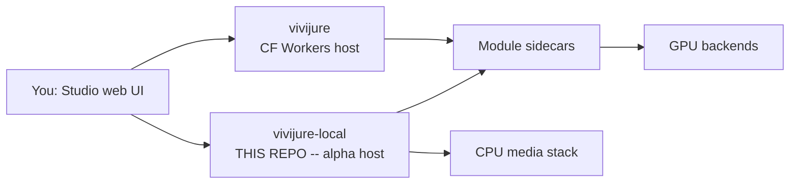

# Vivijure Local

**Alpha -- not production-ready.** This repo is demonstration scaffolding for a future homelab
edition of the **Vivijure Control Panel**. It proves the same modular film studio API and UI on
Node, SQLite, and S3-compatible storage without Cloudflare Workers, D1, or R2. The layout,
platform adapters, and operator story **will change dramatically** as we move toward
[`vivijure-core`](docs/ROADMAP.md) and vivijure v2.0. For a production studio today, use upstream
[`vivijure`](https://github.com/skyphusion-labs/vivijure).

Provider-neutral host for [Vivijure Studio](https://github.com/skyphusion-labs/vivijure): same
reference API ([`CONTRACT.md`](https://github.com/skyphusion-labs/vivijure/blob/main/docs/CONTRACT.md)
in the upstream repo), same `public/` UI, different runtime. GPU render backends
(`vivijure-backend`, `vivijure-local-12gb`, `vivijure-local-16gb`) are unchanged; this repo swaps
only the **control plane host**.

## Who this is for

Homelab builders and contributors who want to run the Vivijure studio contract on their own box
without a Cloudflare account: explore the module registry, exercise the render orchestrator, and
gate changes with the parity smoke tests. It is a **lab bench**, not a supported production deploy.

**Production path:** [vivijure quickstart](https://github.com/skyphusion-labs/vivijure/blob/main/docs/quickstart.md) · **This repo:** [docs/quickstart.md](docs/quickstart.md)

## Quick start

```bash
npm run install:studio        # mint token + seed platform_secrets
npm run compose:up            # pull GHCR :latest + docker compose up -d
curl -fsS http://127.0.0.1:8790/health
```

Open http://127.0.0.1:8790 and paste the token from `.studio-token`. The friendly walk-through is
[docs/quickstart.md](docs/quickstart.md); the full operator reference is
[docs/DEPLOYMENT.md](docs/DEPLOYMENT.md).

Verify the demo pipeline:

```bash
npm run smoke:exit            # bundle -> render -> poll -> artifact
```

## Where this fits: the constellation

Vivijure is a small group of repos that work together. The **Studio** control plane sits in the
center. This repo is an alternate **host** for that same control plane (Node/Docker instead of
Cloudflare Workers). The full map is in [docs/constellation.md](docs/constellation.md).



## Documentation

| Doc | Purpose |
|-----|---------|
| [docs/quickstart.md](docs/quickstart.md) | Short homelab path (compose up, token, smoke) |
| [docs/DEPLOYMENT.md](docs/DEPLOYMENT.md) | Full operator reference (env, GPU, troubleshooting) |
| [docs/SECURITY.md](docs/SECURITY.md) | Token auth, single-operator model, exposure |
| [docs/constellation.md](docs/constellation.md) | How this repo fits the Vivijure map |
| [docs/ARCHITECTURE.md](docs/ARCHITECTURE.md) | Platform adapters and module transport |
| [docs/PARITY.md](docs/PARITY.md) | API route checklist vs upstream |
| [docs/ROADMAP.md](docs/ROADMAP.md) | Milestones; [PHASE3.md](docs/PHASE3.md) shared-core extraction |

## Strategy

| Phase | Goal |
|-------|------|
| **v1 (this repo, Option B)** | Fork-adapt the vivijure core onto Node + SQLite + object storage. Prove CONTRACT parity on a homelab stack. |
| **v2 (vivijure 2.0, Option A)** | Extract shared orchestration into `vivijure-core`; both hosts become thin adapters. |

Phase 1 milestones (M0--M8) and the crew demo exit criterion are **done** on `main`; see
[docs/ROADMAP.md](docs/ROADMAP.md).

## What is copied verbatim from vivijure

- `public/` -- planner / cast / settings UI (projection from `GET /api/modules`)
- `migrations/` -- SQLite schema (D1-compatible SQL)
- `src/modules/types.ts` -- `vivijure-module/2` contract (dependency-free)

Everything else is ported behind `src/platform/` adapters. Object storage defaults to **MinIO**
(`S3_*` in `.env`); R2 or AWS S3 is a config swap.

## License

AGPL-3.0-only (same as vivijure).
