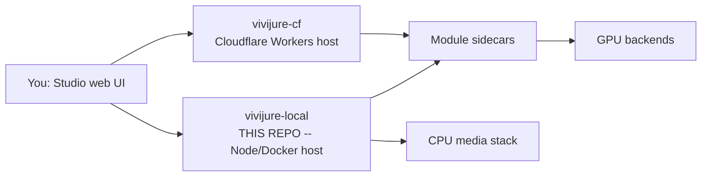

# Vivijure Local

**Run the Vivijure film studio control panel on a home computer or any cloud server** -- Node,
SQLite, and S3-compatible storage, **no Cloudflare account**. Same modular film-studio API and UI
as the Cloudflare host ([`vivijure-cf`](https://github.com/skyphusion-labs/vivijure-cf)), a
different runtime. Verified end to end on the homelab stack (bundle -> render -> finished artifact).

Both hosts share [`vivijure-core`](https://github.com/skyphusion-labs/vivijure-core). Prefer
Cloudflare Workers instead? Use [`vivijure-cf`](https://github.com/skyphusion-labs/vivijure-cf).
Drive either host from an agent with [`vivijure-mcp`](https://github.com/skyphusion-labs/vivijure-mcp).
Constellation map: [`vivijure`](https://github.com/skyphusion-labs/vivijure).

Provider-neutral host for [Vivijure Studio](https://vivijure.com): same reference API
([`CONTRACT.md`](https://github.com/skyphusion-labs/vivijure-cf/blob/main/docs/CONTRACT.md)), same
`public/` UI, different runtime. GPU render backends (`vivijure-backend`, `vivijure-local-12gb`,
`vivijure-local-16gb`) are unchanged; this repo swaps only the **control panel host**.

## Who this is for

Homelab builders who want to run the Vivijure studio contract on their own box without a Cloudflare
account: the module registry, the render orchestrator, and the parity smoke tests, all on
Node/Docker. It uses the same **single-operator** trust model as the Cloudflare host -- keep it on a
network you control (see [docs/SECURITY.md](docs/SECURITY.md)).

**Run on Cloudflare instead:** [vivijure-cf](https://github.com/skyphusion-labs/vivijure-cf) · **This repo (self-host):** [docs/quickstart.md](docs/quickstart.md)

## Quick start

```bash
npm run install:studio        # mint token + seed platform_secrets
npm run compose:up            # pull GHCR :latest + docker compose up -d
curl -fsS http://127.0.0.1:8790/health
```

Open http://127.0.0.1:8790 and paste the token from `.studio-token`. The friendly walk-through is
[docs/quickstart.md](docs/quickstart.md); the full operator reference is
[docs/DEPLOYMENT.md](docs/DEPLOYMENT.md).

Verify the render pipeline:

```bash
npm run smoke:exit            # bundle -> render -> poll -> artifact
```

## Where this fits: the constellation

Vivijure is a small group of repos that work together. The **Studio** control plane sits in the
center. This repo is an alternate **host** for that same control plane (Node/Docker instead of
Cloudflare Workers). The full map is in [docs/constellation.md](docs/constellation.md).



## Documentation

| Doc | Purpose |
|-----|---------|
| [docs/quickstart.md](docs/quickstart.md) | Short homelab path (compose up, token, smoke) |
| [docs/DEPLOYMENT.md](docs/DEPLOYMENT.md) | Full operator reference (env, GPU, troubleshooting) |
| [docs/SECURITY.md](docs/SECURITY.md) | Token auth, single-operator model, exposure |
| [docs/EDGE.md](docs/EDGE.md) | Public HTTPS with Caddy + Let's Encrypt (studio + MinIO wildcard) |
| [docs/constellation.md](docs/constellation.md) | How this repo fits the Vivijure map |
| [docs/ARCHITECTURE.md](docs/ARCHITECTURE.md) | Platform adapters and module transport |
| [docs/PARITY.md](docs/PARITY.md) | API route checklist vs the studio host |
| [docs/ROADMAP.md](docs/ROADMAP.md) | Milestones; [PHASE3.md](docs/PHASE3.md) shared-core extraction |

## Strategy

| Phase | Goal |
|-------|------|
| **v1 (this repo, Option B)** | Fork-adapt the Vivijure studio core onto Node + SQLite + object storage. Hold CONTRACT parity on a homelab stack. |
| **v2 (shared core, Option A)** | Extract shared orchestration into `vivijure-core`; both hosts become thin adapters. |

Phase 1 milestones (M0--M8) and the crew demo exit criterion are **done** on `main`; see
[docs/ROADMAP.md](docs/ROADMAP.md).

## What is copied verbatim from the studio host

- `public/` -- planner / cast / settings UI (projection from `GET /api/modules`), held in parity with [`vivijure-cf`](https://github.com/skyphusion-labs/vivijure-cf) `public/`
- `migrations/` -- SQLite schema (D1-compatible SQL)
- `src/modules/types.ts` -- the `vivijure-module/2` contract (shared, dependency-free; tracked against `vivijure-core`)

Everything else is ported behind `src/platform/` adapters. Object storage defaults to **MinIO**
(`S3_*` in `.env`); R2 or AWS S3 is a config swap.

## License

AGPL-3.0-only (same as the rest of the Vivijure constellation).
