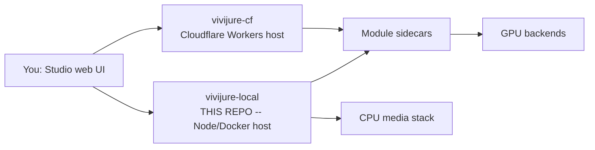

# Vivijure Local

**Self-hosted Vivijure Studio for homelab and hobbyist builders** -- Node, SQLite, and
S3-compatible storage, **no Cloudflare account required**. Full **capability parity** with
[`vivijure-cf`](https://github.com/skyphusion-labs/vivijure-cf): same modular film-studio API,
same `vivijure-module/2` contract, same `public/` UI, different runtime. Default path is
**Ollama plan.enhance → unload → local-gpu keyframe (16GB door first) → CPU finish**. The default
compose stack registers **no RunPod modules**
([local#265](https://github.com/skyphusion-labs/vivijure-local/issues/265),
[local#200](https://github.com/skyphusion-labs/vivijure-local/issues/200)).

For **production** workloads (Cloudflare Workers, R2, AI Gateway, RunPod render testbed), use
[`vivijure-cf`](https://github.com/skyphusion-labs/vivijure-cf).

Both hosts share [`vivijure-core`](https://github.com/skyphusion-labs/vivijure-core). Drive either
host from an agent with [`vivijure-mcp`](https://github.com/skyphusion-labs/vivijure-mcp).
Constellation map: [`vivijure`](https://github.com/skyphusion-labs/vivijure).

**Dependency pins (this repo, see `package.json` / lock):** `@skyphusion-labs/vivijure-core`
`^1.5.0` (lock `1.5.0`), `@skyphusion-labs/vivijure-mcp` `^1.1.0` (lock `1.1.0`). Product
capability parity with `vivijure-cf` is the dual-panel release-wave gate; package floors can lag
the CF host.

Provider-neutral host for [Vivijure Studio](https://vivijure.com): same reference API
([`CONTRACT.md`](https://github.com/skyphusion-labs/vivijure-cf/blob/main/docs/CONTRACT.md)).
GPU render backends (`vivijure-local-16gb` first, `vivijure-local-12gb` alternate, finish sidecars)
plug in via module URLs; this repo is the **control panel host** only.

## Local vs Cloudflare (`vivijure-cf`)

| | **vivijure-local** (this repo) | **vivijure-cf** (production) |
|---|---|---|
| **Who** | Homelab / hobbyist self-host | Cloudflare-hosted studio |
| **Runtime** | Node + Docker + MinIO + Ollama | Workers + D1 + R2 |
| **Contract** | Full parity (`CONTRACT.md`, module registry) | Same |
| **GPU default** | Ollama + 16GB local door + CPU finish | RunPod (`vivijure-backend` + finish satellites) |
| **RunPod** | Opt-in only (`COMPOSE_PROFILES=cloud` / satellites) | Canonical render/finish testbed |
| **When to pick** | Your box, LAN you control, own GPU | Production, free-tier CF stack, no homelab ops |

Route checklist: [docs/PARITY.md](docs/PARITY.md). Homelab operator path: [docs/quickstart.md](docs/quickstart.md).
CF path: [vivijure-cf quickstart](https://github.com/skyphusion-labs/vivijure-cf/blob/main/docs/quickstart.md).

## Rendering without RunPod (the default)

You never need a RunPod account. A complete film renders with **zero RunPod modules** in the default
compose stack:

- **Planning (`plan.enhance`)** runs on **local Ollama** (default `qwen3:14b`, ~9.3GB Q4 on a
  16GB card); the model is unloaded before keyframe work claims the GPU.
- **Motion and keyframes** render on your own GPU through the local door
  ([`vivijure-local-16gb`](https://github.com/skyphusion-labs/vivijure-local-16gb) first;
  [`vivijure-local-12gb`](https://github.com/skyphusion-labs/vivijure-local-12gb) alternate); set
  `LOCAL_BACKEND_URL` and run `npm run install:studio`.
- **Optional CF AI** overlays (dialogue / music / narration) when you add gateway creds; not required
  for the Ollama + door path.
- **Finish** runs on the CPU `video-finish` container (assemble and mux), plus optional local
  lipsync / upscale sidecars.

**A GPU engine is required to render.** Compose brings the rest of the stack up without one: the door
module lives in the `localgpu` profile, so with no door it is simply **not in the stack** -- nothing to
hide, nothing to refuse. `GET /api/modules` then reports `keyframe` and `motion.backend` as
unavailable with the knob named, so the panel greys those controls out before a render is spent.
Nothing is rendered with placeholder frames (see
[local#229](https://github.com/skyphusion-labs/vivijure-local/issues/229),
[local#280](https://github.com/skyphusion-labs/vivijure-local/issues/280)).
Set `PLANNER_AI_MOCK=true` if you skip the Ollama model pull.

**Optional: wire RunPod** via `COMPOSE_PROFILES=cloud` (or satellites) for cloud i2v, RunPod
keyframe, MiniMax HD narration, RunPod finish. Strictly opt-in. Wiring guide:
[docs/DEPLOYMENT.md](docs/DEPLOYMENT.md).

## Who this is for

Homelab and hobbyist builders who want the full Vivijure studio on their own box: module registry,
render orchestrator, local GPU door, and local finish sidecars, all on Node/Docker without a
Cloudflare account. Same **single-operator** trust model as the CF host; keep it on a network you
control (see [docs/SECURITY.md](docs/SECURITY.md)).

**Production / Cloudflare:** [vivijure-cf](https://github.com/skyphusion-labs/vivijure-cf) · **Homelab path:** [docs/quickstart.md](docs/quickstart.md)

**Vivijure Studio:** https://vivijure.com · **Live demo:** https://demo.vivijure.com · **Skyphusion Labs:** https://skyphusion.org

## Quick start

```bash
npm run install:studio        # mint token + seed platform_secrets
npm run compose:up            # pull GHCR :latest + docker compose up -d
curl -fsS http://127.0.0.1:8790/health
```

Open http://127.0.0.1:8790 and paste the token from `.studio-token`. The friendly walk-through is
[docs/quickstart.md](docs/quickstart.md); the full operator reference is
[docs/DEPLOYMENT.md](docs/DEPLOYMENT.md).

Verify the render pipeline:

```bash
npm run smoke:exit            # bundle -> render -> poll -> artifact
```

## Where this fits: the constellation

Vivijure is a small group of repos that work together. The **Studio** control plane sits in the
center. This repo is an alternate **host** for that same control plane (Node/Docker instead of
Cloudflare Workers). The full map is in [docs/constellation.md](docs/constellation.md).


```mermaid
flowchart LR
    you[You: Studio web UI]
    local[vivijure-local<br/>THIS REPO -- Node/Docker host]
    cf[vivijure-cf<br/>Cloudflare Workers host]
    modules[Module sidecars]
    gpu[GPU backends]
    cpu[CPU media stack]

    you --> local
    you --> cf
    local --> modules
    cf --> modules
    modules --> gpu
    local --> cpu
```

## Documentation

| Doc | Purpose |
|-----|---------|
| [docs/quickstart.md](docs/quickstart.md) | Short homelab path (compose up, token, smoke) |
| [docs/DEPLOYMENT.md](docs/DEPLOYMENT.md) | Full operator reference (env, GPU, troubleshooting) |
| [docs/SECURITY.md](docs/SECURITY.md) | Token auth, single-operator model, exposure |
| [docs/EDGE.md](docs/EDGE.md) | Public HTTPS with Caddy + Let's Encrypt (studio + MinIO wildcard) |
| [docs/constellation.md](docs/constellation.md) | How this repo fits the Vivijure map |
| [docs/FINISH_BACKEND.md](docs/FINISH_BACKEND.md) | Homelab local finish vs RunPod ([local#180](https://github.com/skyphusion-labs/vivijure-local/issues/180)) |
| [docs/ARCHITECTURE.md](docs/ARCHITECTURE.md) | Platform adapters and module transport |
| [docs/PARITY.md](docs/PARITY.md) | API route checklist vs the studio host |
| [docs/ROADMAP.md](docs/ROADMAP.md) | Milestones; [PHASE3.md](docs/PHASE3.md) shared-core extraction |

## Strategy (historical)

| Phase | Goal | Status |
|-------|------|--------|
| **v1 (Option B)** | Node + SQLite + object storage host; CONTRACT parity on a homelab stack | done |
| **v2 (shared core)** | Orchestration in `@skyphusion-labs/vivijure-core`; hosts thin adapters | **done** (published dep) |

Phase 1 milestones (M0--M8) and Phase 3 extraction are **done** on `main`; see
[docs/ROADMAP.md](docs/ROADMAP.md).

## What this host keeps vs what lives in core

- `public/` -- planner / cast / settings UI (projection from `GET /api/modules`); product parity with
  [`vivijure-cf`](https://github.com/skyphusion-labs/vivijure-cf) is a release-wave review obligation
  (no byte-identity CI)
- `migrations/` -- SQLite schema (D1-compatible SQL)
- `src/platform/` -- Node Platform adapters
- **Module contract + orchestration** -- `@skyphusion-labs/vivijure-core` (not a forked
  `src/modules/types.ts` in this repo)

Object storage defaults to **MinIO** (`S3_*` in `.env`); R2 or AWS S3 is a config swap.

## License

AGPL-3.0-only (same as the rest of the Vivijure constellation).

That grant covers the SOFTWARE. The model weights the local GPU door runs carry their own
third-party licenses, several of which restrict commercial use; the per-model truth, and the
two supported commercial paths, are in [USE.md](USE.md).
