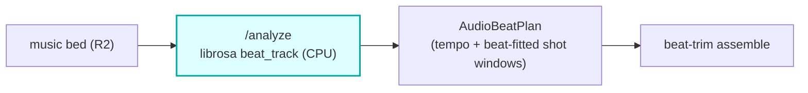

# audio-beat-sync

A CPU **HTTP container** reached over Workers VPC: **librosa beat analysis**. The Worker presigns a
short-lived R2 GET URL and POSTs `{ audioUrl, ... }` to `/analyze`; the container streams the bytes, runs
`librosa.beat.beat_track`, fits clip boundaries onto the beats, and returns the snake_case
`AudioBeatPlan` the core's `parseAudioBeatPlan` expects. Stateless and credentialless, CPU-only, no R2
binding (presign keeps credentials on the Worker).

## Where it fits

On the **score path**: when a film carries a music bed, beat-aware cutting trims each clip so shot
boundaries land on musical beats (a music-video maker's edit instead of arbitrary scene seconds). The
core's `beat-analyze` calls `AUDIO_BEAT_SYNC_VPC` to get the plan, then the hybrid assembler beat-trims
each clip to it.

## HTTP contract

| Route | Method | Purpose |
|---|---|---|
| `/health` | GET | readiness (`{ok:true}`) |
| `/analyze` | POST | beat-track the bed + fit clip boundaries -> `AudioBeatPlan` |

`/analyze` body: `{ audioUrl (presigned GET), ... }` -> the `AudioBeatPlan` shape (tempo, beat times, and
the per-shot windows fitted to beats). Failures return as data.

## DSP

`librosa.beat.beat_track` (tempo + beat-frame extraction) over the decoded bed, then a fit of the
authored clip boundaries onto the nearest beats. CPU-only.

## Operations

- compose service `audio-beat-sync` on `127.0.0.1:8782:8000`, `vivijure` network.
- Binding: `AUDIO_BEAT_SYNC_VPC` on the core. Service host name MUST match the compose service name.
- Deploy on your container host: `docker compose -p vivijure-media -f containers/compose.yaml up -d --build audio-beat-sync`;
  health: `curl http://127.0.0.1:8782/health`.

## Soft-degrade

No detectable beats or an analysis failure falls back to the authored scene durations (un-beat-synced
cutting); recorded, never silent.

## License

**AGPL-3.0-only.** A labor of love, given freely: use it, learn from it, self-host it, build your own creative visions on it. Run it as a network service and the AGPL has you share your changes back, so it stays a commons. It is not for sale, and not to be resold as a SaaS.
