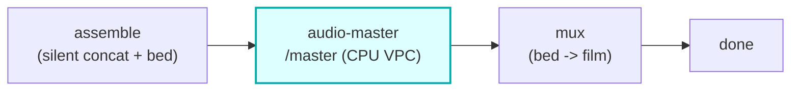

# audio-master

A CPU/ffmpeg **HTTP container** (Workers VPC): film-level **audio mastering** -- an optional **music
upscale** (VHQ soxr resample to 48 kHz + a gentle high-shelf "air" lift) followed by **two-pass LUFS
loudness normalization** to a web target. It is reached by the `modules/audio-master` worker over the
`AUDIO_MASTER_VPC` binding, NEVER RunPod/GPU (CPU mastering is ffmpeg DSP, and GPU money is for GPU work
only). Stateless and credentialless -- the Worker presigns an R2 GET for the assembled bed + a PUT for
the mastered output, bytes never touch the Worker, CPU-only ffmpeg.

## Where it fits

The `master` step of the film render: after the silent film is assembled and an audio bed exists, the
core runs the `master` chain to polish that bed (loudness + music upscale) BEFORE it is muxed onto the
silent film. `audio-master` is the CPU container behind that step. The seam is **credentialless**: the
core owns the R2 creds and presigns the bed GET + the mastered PUT, then hands those URLs to the module,
which forwards them to this container over Workers VPC. The container reads `audioUrl`, masters, and PUTs
to `outputUrl`; it holds no R2 creds.

A `master` miss soft-degrades to the un-mastered bed, so the mux always has audio to lay down (see
[Soft-degrade](#soft-degrade)).

## HTTP contract

| Route | Method | Purpose |
|---|---|---|
| `/health` | GET | readiness (`{ok:true}`) |
| `/master` | POST | music upscale + two-pass loudnorm of one audio bed -> mastered wav/mp3 |

`/master` body: `{ audioUrl (presigned GET), outputUrl (presigned PUT), outputKey, targetLufs, upscale
(bool), format ("wav"|"mp3") }` -> `{ ok, key, bytes, format, durationSeconds, lufs, loudnessTargetLufs,
upscaled }`. The response reports STRUCTURED facts (`upscaled`, `loudnessTargetLufs`) from which the
module composes its honest `applied` tags. Failures return as data (`{ok:false, error}`) with a non-2xx
status.

## DSP

ffmpeg, CPU-only (the DSP lives in `master_core.master_bed`):

- **Music upscale** (`upscale`): a VHQ `soxr` resample to 48 kHz (precision 28) plus a gentle high-shelf
  "air" lift (+2.5 dB at 9 kHz) -- it restores presence lost to a low-bitrate source. It sets level and
  sample rate; it does NOT hallucinate detail. Tagged `music-upscale:soxr48k`. With `upscale` off, a
  plain 48 kHz resample runs instead (no lift, no tag).
- **Two-pass loudnorm** (`target_lufs`): measure the bed's loudness, then apply `loudnorm` with the
  measured values to land at the target (the same measure-then-apply discipline the mixer uses). Tagged
  `loudnorm:<target>LUFS`.
- **format**: `wav` (pcm_s16le) or `mp3` (libmp3lame 192k). Mastering may re-encode wav -> mp3.

Config (the module's `config_schema`, clamped by the core): `target_lufs` (float, -24..-9, default -14),
`upscale` (bool, default true), `format` (enum wav/mp3, default wav).

## Operations

- compose service `audio-master` on `127.0.0.1:8784:8000`, `vivijure` network.
- Binding: `AUDIO_MASTER_VPC` (in `modules/audio-master/wrangler.toml`). The VPC Service host name MUST
  match the compose service name (`audio-master`); the `service_id` is a clearly-marked placeholder
  (`TBD-STRUMMER-AUDIO-MASTER-VPC`) until the Workers VPC Service is created.
- Deploy on your container host: `docker compose -p vivijure-media -f containers/compose.yaml up -d --build audio-master`;
  health: `curl http://127.0.0.1:8784/health`.

## Soft-degrade

A polish step never fails the render. A missing binding, an unreachable container, a non-2xx response, an
unreadable / `ok:false` body, or a result with no mastered key passes the INPUT bed through unchanged with
`degraded` set to the honest reason (e.g. `passthrough:container-failed`) -- never a fake "applied" tag,
so a degrade is never silent. A master miss therefore ships the un-mastered (but intact) audio; it never
drops a fully-rendered film.

## License

**AGPL-3.0-only.** A labor of love, given freely: use it, learn from it, self-host it, build your own creative visions on it. Run it as a network service and the AGPL has you share your changes back, so it stays a commons. It is not for sale, and not to be resold as a SaaS.
