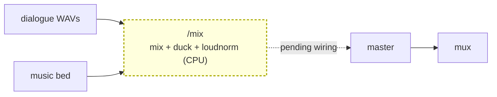

# audio-mix

A CPU/ffmpeg **HTTP container** (Workers VPC): **multi-track mix + sidechain duck + LUFS loudnorm**. It
mixes a film's audio tracks -- dialogue + music (+ optional sfx) -- with the music ducked UNDER the
speech (sidechaincompress keyed on the dialogue) and the whole mix two-pass loudness-normalized to a web
target (-14 LUFS by default). A flat `amix` sounds amateur; the duck keeps speech intelligible.
Stateless and credentialless -- the Worker presigns R2 GET URLs per track + a PUT for the mixed output,
bytes never touch the Worker, CPU-only ffmpeg.

> **Status: built, not yet wired (tracked follow-up).** The container and its DSP (`mix_core.py`,
> validated by `test_local.py`) are complete, but there is **no core binding (`AUDIO_MIX_VPC`) or caller
> yet** -- it is a staged capability pending integration into the assemble/mux path. It is NOT in the
> v0.3.0 cut. Documented here so the contract stays reproducible from the docs; the wiring is the
> follow-up.

## Where it fits

INTENDED position: the assemble/mux stage of a talking-or-scored film. Today the core muxes a single
pre-built bed; `audio-mix` replaces that with a proper multi-track mix (dialogue + ducked music) before
the bed is mastered and muxed onto the silent film. When wired it sits just ahead of the `master` step
(`audio-master`): mix the tracks, then master the mixed bed, then mux.

(Dashed = the not-yet-wired seam.)

## HTTP contract

| Route | Method | Purpose |
|---|---|---|
| `/health` | GET | readiness (`{ok:true}`) |
| `/mix` | POST | multi-track mix + duck + two-pass loudnorm -> mixed mp3/wav |

`/mix` body: `{ tracks: [{ url (presigned GET), role, gainDb }], outputUrl (presigned PUT), outputKey,
format ("mp3"|"wav"), loudnessTargetLufs }` -> `{ ok, key, bytes, format, durationSeconds, lufs, ducked,
tracks }`. `role` is one of the mixer roles (dialogue / music / sfx). Failures return as data.

## DSP

ffmpeg, CPU-only: per-track gain, `sidechaincompress` (music keyed on the dialogue track) for the duck,
`amix`, then a two-pass `loudnorm` to the target LUFS. The DSP lives in `mix_core.mix_tracks`.

## Operations

- compose service `audio-mix` on `127.0.0.1:8783:8000`, `vivijure` network.
- Binding (to be created when wired): `AUDIO_MIX_VPC`. Service host name MUST match the compose service
  name.
- Deploy on your container host: `docker compose -p vivijure-media -f containers/compose.yaml up -d --build audio-mix`;
  health: `curl http://127.0.0.1:8783/health`.

## Soft-degrade

When wired, a mix failure degrades to the existing single-bed mux (the film still gets audio), recorded
and never silent.

## License

**AGPL-3.0-only.** A labor of love, given freely: use it, learn from it, self-host it, build your own creative visions on it. Run it as a network service and the AGPL has you share your changes back, so it stays a commons. It is not for sale, and not to be resold as a SaaS.
