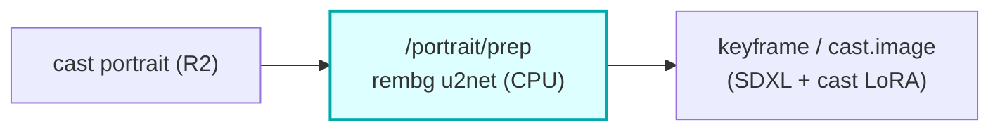

# image-prep

A CPU **HTTP container** reached over Workers VPC: **rembg (u2net) background removal** for cast
portraits. The Worker presigns an R2 GET (source portrait) + PUT (cleaned PNG) and POSTs both to
`/portrait/prep`; the container strips the background, optionally composites onto black, and PUTs the
result. Stateless and credentialless -- image bytes never touch the Worker, CPU-only onnxruntime, no R2
binding (presign keeps credentials on the Worker).

## Where it fits

It cleans cast reference portraits **before** they condition the keyframe / `cast.image` path. A clean
cutout makes the SDXL + cast-LoRA keyframe (and the cloud-keyframe reference conditioning) sharper than a
busy-background portrait would. The core's bundle assembler calls `IMAGE_PREP_VPC` when preparing cast
portraits, ahead of keyframe generation.

## HTTP contract

| Route | Method | Purpose |
|---|---|---|
| `/health` | GET | readiness (`{ok:true}`); the u2net model is warmed at boot before `:8000` binds |
| `/portrait/prep` | POST | strip background -> cleaned PNG (optional black composite) |

`/portrait/prep` body: `{ sourceUrl (presigned GET), outputUrl (presigned PUT), composite? }` ->
`{ ok, ... }`. Failures return as data (`{ ok: false, error }`).

## DSP

rembg `u2net` background removal on onnxruntime (CPU); optional composite onto a black matte; PNG out.
The model is baked into the image and warmed before the port-ready probe so the container never reports
healthy before it can serve.

## Operations

- compose service `image-prep` on `127.0.0.1:8781:8000`, `vivijure` network.
- Binding: `IMAGE_PREP_VPC` on the core. Service host name MUST match the compose service name.
- Deploy on your container host: `docker compose -p vivijure-media -f containers/compose.yaml up -d --build image-prep`;
  health: `curl http://127.0.0.1:8781/health`.

## Soft-degrade

A prep failure falls back to the original portrait (the keyframe path still runs, just without the clean
cutout); recorded, never silent.

## License

**AGPL-3.0-only.** A labor of love, given freely: use it, learn from it, self-host it, build your own creative visions on it. Run it as a network service and the AGPL has you share your changes back, so it stays a commons. It is not for sale, and not to be resold as a SaaS.
