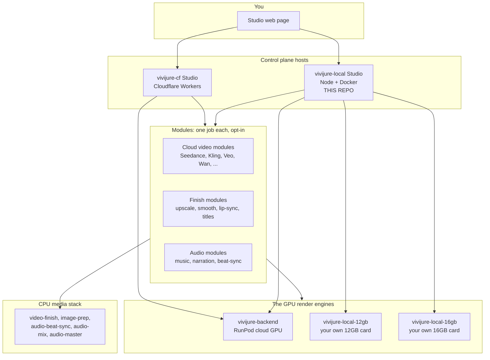

# Where each piece fits: the Vivijure map

Vivijure is not one program. It is a small group of programs that work together. We call the
whole group the **constellation**. This page shows the map once. Every repo in the constellation
shows this same map, so you always know where you are.

The **Studio** is the center. It is the control plane: it holds your projects, your storyboards,
your cast, and it tells everything else what to do. You talk to the Studio; the Studio talks to
everything else.

**This repo (`vivijure-local`)** is an alternate **host** for that same control plane: run it on
a home computer or any cloud server. The Cloudflare-hosted studio is
[`vivijure-cf`](https://github.com/skyphusion-labs/vivijure-cf). Both hosts share
[`vivijure-core`](https://github.com/skyphusion-labs/vivijure-core). `vivijure-local` runs the same
API and UI on Node, SQLite, and S3-compatible storage (MinIO by default), verified end to end.
Agents drive either host with [`vivijure-mcp`](https://github.com/skyphusion-labs/vivijure-mcp).

## How to read the map

- **You** open the Studio web page. On Cloudflare that is your deployed Worker; on the homelab
  path it is `http://127.0.0.1:8790` (or your LAN address) after `docker compose up`.
- **The Studio** owns your work and decides what runs. It does not render video itself. It hands
  heavy work to a **module**.
- **A module** is a small worker that does one job: keyframes, motion, finish polish, scoring.
  The Studio keeps a **registry**; the web page builds itself from `GET /api/modules`.
- **GPU engines** do the real clip rendering. **CPU containers** assemble clips, mux audio, and
  run beat analysis. On `vivijure-local`, both run in `docker compose` by default (GPU mocks
  included for the demo path; point `MODULE_LOCAL_GPU_URL` at a real backend when you have one).

## Two hosts, one contract

Full **capability parity**: same JSON API, same module registry, same `vivijure-module/2`
contract. Different runtime and different **default GPU path**.

| Host | Intent | GPU default | When to use it |
|---|---|---|---|
| **vivijure-cf** (Cloudflare) | Production studio | RunPod render + finish satellites | Workers, R2, AI Gateway; canonical cloud testbed. [CF quickstart](https://github.com/skyphusion-labs/vivijure-cf/blob/main/docs/quickstart.md). |
| **vivijure-local** (this repo) | Homelab / hobbyist | Local GPU door + local finish sidecars | Self-host on your box; no Cloudflare account. RunPod optional ([local#180](https://github.com/skyphusion-labs/vivijure-local/issues/180), [FINISH_BACKEND.md](FINISH_BACKEND.md)). |

Canonical ICD: [vivijure-cf/docs/CONTRACT.md](https://github.com/skyphusion-labs/vivijure-cf/blob/main/docs/CONTRACT.md).
Route-level parity: [PARITY.md](PARITY.md).

---

*This map is the same in every constellation repo. You are reading the homelab host edition.*
